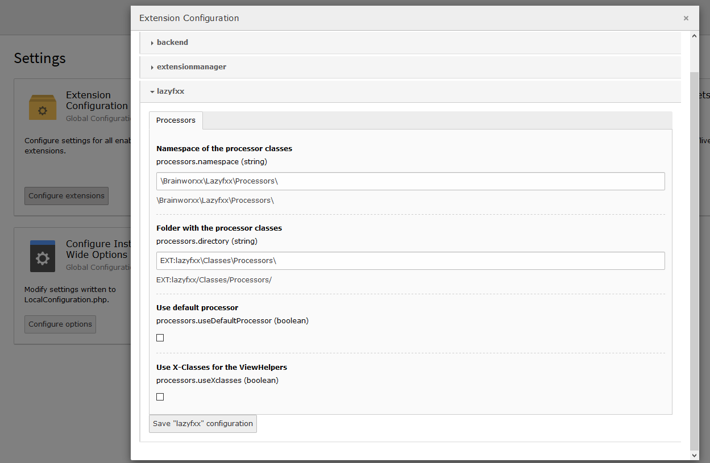

.. ==================================================
.. FOR YOUR INFORMATION
.. --------------------------------------------------
.. -*- coding: utf-8 -*- with BOM.

.. include:: ../Includes.txt

Configuration and usage
=======================

The configuration options are placed in the extension manager. When changing the configuration here, be sure to clear all caches afterwards.

	Screenshot from the extension manager, where you can find the configuration options.

Namespace of the processor classes
^^^^^^^^^^^^^^^^^^^^^^^^^^^^^^^^^^

The namespace of the processor classes that you want to use.

Folder with the processor classes
^^^^^^^^^^^^^^^^^^^^^^^^^^^^^^^^^

Here you can enter a folder with the processor classes. When cleaning the system cache, this folder will be parsed and all containing processor classes will be available.
The containing classes will not be autoloaded, so you have to use an extension to provide them.

Use default processor
^^^^^^^^^^^^^^^^^^^^^

If you use this option, the redakteur will not be able to choose the image processor for the lazy loading. THe default processor will be uses.

From the provided processors, this is the :literal:`Grayscale and Blur` processor, because it makes the image really small.

The default processor is set via TypScript:

.. code-block:: typoscript

    plugin.tx_lazyfxx.settings {
        # Defining the default processor.
        default = Brainworxx\Lazyfxx\Processors\GrayscaleBlurProcessor
    }

Use X-Classes for the ViewHelpers
^^^^^^^^^^^^^^^^^^^^^^^^^^^^^^^^^

If you check this option, LazyFxx will use X-Classes to add its functionality to the frontend. The following ViewHelpers will be X-Classes:

  - <f:image>
  - <f:media>

Whenever one of these ViewHelpers is used in your templates, LazyFxx is also used. Of cause X-Classing them may cause trouble elsewhere, and you may want to choose when you actually provide lazy loading on the frontend.
That is why we have provided ViewHelpers for this purpose:

.. code-block:: html

    <html xmlns:f="http://typo3.org/ns/TYPO3/CMS/Fluid/ViewHelpers"
          xmlns:lfxx="http://typo3.org/ns/Brainworxx/Lazyfxx/ViewHelpers"
          data-namespace-typo3-fluid="true">

    <lfxx:image src="path/to/my/image.png" alt="some description" />
    <lfxx:media file="path/to/my/file.ext" width="400" height="375" />

    </html>

The options for these VewHelpers are exactly the same as for the standard image anf media ViewHelpers.

Use only the JavaScript and not the processor
^^^^^^^^^^^^^^^^^^^^^^^^^^^^^^^^^^^^^^^^^^^^^

If you do not want to use the image processing of TYPO3 and only want to use the java script part, you only need to do the following:

  - The src needs to point to the placeholder image.
  - Add the class :literal:`lazyload-placeholder` to your image.
  - Add the attribute :literal:`data-src` with the path to the image you want to load.
  - Make sure that the files :literal:`lazyfxx.js` and :literal:`styles.css` are included on the frontend.

.. code-block:: html

    <f:image image="{imagePlaceholderObject}"
             class="lazyload-placeholder"
             data="{src: pathToOriginal}" />